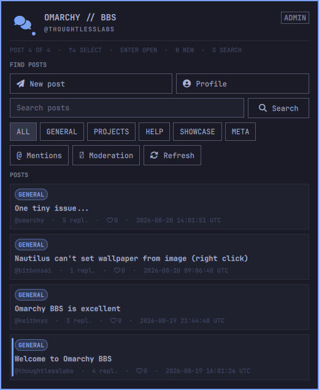
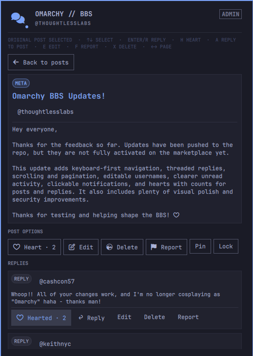

# Omarchy BBS

A native community message board with registration gated through its Omarchy
client.
It includes an Omarchy 4 bar widget, a signed device client, and a PHP/MySQL
service. Reading, writing, and joining all happen in the themed shell panel—no
browser tab is opened.

The board supports categories, properly nested reply trees, hearts with counts, paginated posts and reply conversations, encrypted search,
per-post unread state, mentions, profiles, unique editable usernames, author editing and deletion,
reports, locks, pins, account suspension, and category moderators. The toolbar
changes to the current theme's active color and shows an activity dot when
you have a deliverable mention; quieter unread activity remains visible inside the board. Omarchy notifications can identify new posts,
replies to your posts or replies, and `@mentions` according to your preferences.
`Feedback` has its own category so suggestions do not have to live in General.
Multiline editors grow with the text and become internally scrollable before
they can overrun the panel. The bar reserves its accent state for mentions;
other unread activity remains visible in the post list. When a newer release
is available, the panel offers Omarchy's standard plugin update action.
The panel itself is bounded and keyboard-first. Arrow keys or `j`/`k` move the
visible selection, Enter opens the selected post, and Page Up/Page Down plus
Home/End provide direct scrolling. Left/right or `h`/`l` change post or reply
pages. Trackpad scrolling is accelerated while multiline editors retain their
own scrolling. In a thread, Enter or `r` replies to the selected reply and `a` replies
to the original post. The reply editor opens directly beneath its target, and
children remain grouped below the correct parent across conversation pages.
Shift+`h` hearts the selected post or reply. `e`, `f`, and `x` edit, report, and delete the selection;
`t` cycles the current thread through Default, Watching, and Muted notification modes.
`0` reselects the original post. Ctrl+Enter submits every editor and Escape
cancels it. Global shortcuts include `n` for a new post, `s` for search, `m`
for mentions, `p` for profile, `R` to refresh, and `b` to return to the list.
The panel shows the active selection and an on-screen shortcut summary.

## Screenshots

| Browse posts | Read and join a thread |
| --- | --- |
|  |  |

## Requirements and boundaries

- Omarchy Quattro (4.x) with its Quickshell-based plugin runtime
- Python 3 on the Omarchy client
- The hosted BBS at `https://bbs.thoughtlesslabs.com`

The plugin never installs packages, requests elevated privileges, or starts a
background service. On first open, it verifies Omarchy locally and suggests the
machine hostname as an editable public username. Registration happens only
after the user confirms that name. The generated device credential is stored
with mode `0600` under `$XDG_STATE_HOME/omarchy-bbs`. After joining, the widget
checks for new activity every minute. Notifications show the other user's
public handle and post title, but never include message content; clicking one
opens that thread directly in the native panel. Existing activity establishes the first-run baseline,
so installing the plugin does not produce a burst of old notifications.

Global controls under Profile & Notifications independently enable desktop
delivery, mentions, replies to your posts or comments, and new posts. Each
thread can inherit those defaults, be watched for every reply, or be muted.
Muted threads remain in unread lists and the Mentions screen; muting only
suppresses bar and desktop alerts. Re-enabling a notification type never
replays activity that happened while it was suppressed. Clicking a reply or
mention notification opens and selects the exact reply conversation.

## Security model

The server accepts registered devices, and the client refuses to register or
make signed requests unless `/usr/share/omarchy` exists and `omarchy version`
succeeds. Every API request is authenticated with a short-lived, single-use
HMAC proof; write signatures are bound to the exact message contents.

Omarchy is open source, so no software-only OS check can be unforgeable. An
attacker can imitate the client. This is a practical community boundary, not
hardware attestation. The production PHP app encrypts message titles, bodies,
and device secrets using authenticated libsodium encryption with a key
stored outside both the database and document root. It also adds registration
throttling, CSRF protection, strict browser security headers, HTTPS-only
headers, rate limits, strict size limits, and durable one-time nonces. Handles
are public and default to the hostname only after the user sees and confirms it.
Users can later change their username from profile settings. The same 3–32
character rules apply, and the database's unique constraint prevents an account
from taking a username already in use. Posts and replies belong to the account,
not a username string, so their displayed author follows a rename.
All community-authored strings are rendered as plain text in both the native
panel and desktop notifications; rich-text markup is never interpreted.

Click the installed discussion icon. Pick or confirm the suggested username,
then select **Join board**. No terminal commands are required.
For development against another server, create `~/.config/omarchy-bbs/config.json`:

```json
{"server_url": "https://bbs.example.com"}
```

You may also set `OMARCHY_BBS_URL`.

## Install the bar plugin

Publish this directory as a Git repository, then install it with:

```bash
omarchy plugin add https://github.com/thoughtlesslabs/omarchy-bbs.git --enable
```

For local development, validate it and add it from the local Git checkout.
The widget talks to `client.py` directly and passes message bodies over stdin so
they do not appear in process arguments.

Move the widget if desired:

```bash
omarchy bar move io.github.thoughtlesslabs.omarchy-bbs --section right
```

## Remove

```bash
omarchy plugin remove io.github.thoughtlesslabs.omarchy-bbs
```

Removing the plugin does not delete the device credential stored at
`~/.local/state/omarchy-bbs/device.json`. Delete that file separately if you
also want to revoke the local login material, and revoke the device in the
server database before reusing its handle.

## Server operations

The production application is in `web/` and requires PHP 8 with PDO MySQL. Its
configuration is intentionally stored outside the public document root at
`~/.config/omarchy-bbs.php`; credentials must never be committed. The app
creates or updates its own tables on startup. Back up the MySQL database and
review registrations periodically before operating it as a public service.
Back up `~/.config/omarchy-bbs.php` separately and securely: losing its
`app_key` makes encrypted messages unrecoverable, while disclosure of both
that file and the database defeats the encryption.

Files under `deploy/` are optional, CLI-only utilities for the hosted service
operator. Omarchy's plugin installer does not execute them, and they do not
modify an installing user's system. For example, the initial server config can
be generated by piping its database password over standard input:

```bash
php deploy/generate-server-config.php /home/USER/.config/omarchy-bbs.php
```

Every new account is a member, regardless of its username. Global administrator
access can only be changed from the server command line; it is never granted by
registration or exposed through the public API. The command also refuses to
remove the final administrator:

```bash
php deploy/manage-admin.php /home/USER/.config/omarchy-bbs.php promote username
php deploy/manage-admin.php /home/USER/.config/omarchy-bbs.php demote username
```

Administrators may assign narrower category-moderator permissions from the
native panel without granting server-wide administrator access.

## Isolated local development

Run the local PHP/SQLite service without touching production:

```bash
./dev/start-local
```

In another terminal, run the complete local API test:

```bash
python3 tests/local_e2e.py
```

Use `./bin/omarchy-bbs-local` for signed API checks. Local state, the encrypted
SQLite database, and the generated server key live under the ignored
`.local-test/` directory. Adding an ignored `.local-test-mode` marker to an
installed development copy makes its normal launcher use this isolated server
and state automatically.
